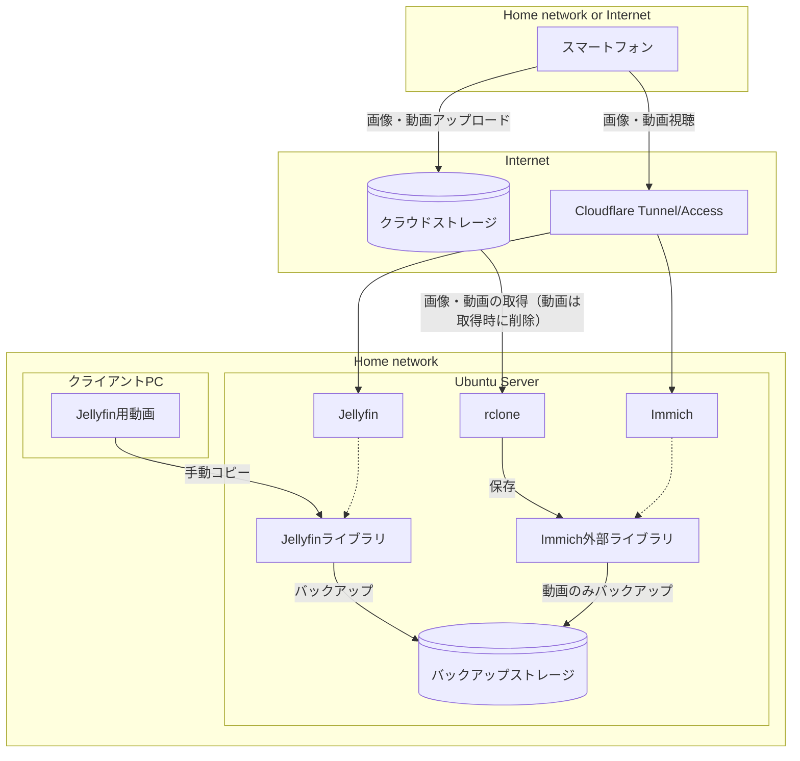
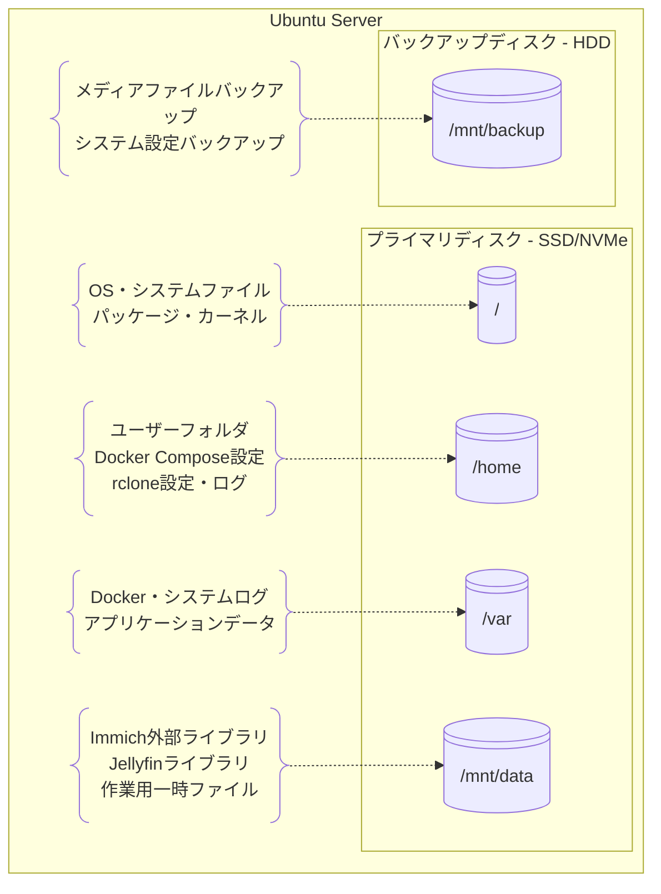

# 概要

本リポジトリは、家庭用のメディアサーバーをLinux環境で構築・運用するためのスクリプトや設定ファイルを管理します。家庭内のミニPCなどにUbuntu Serverを導入し、スマートフォンで撮影した画像や動画を効率的かつ安全に管理・公開することを目的とします。

## システム概要

本システムでは、家族の画像や動画を安全かつ効率的に管理・公開するためのメディアサーバーを構築します。Ubuntu Serverをベースとし、Docker上でImmichとJellyfinを実行して、スマートフォンで撮影したメディアを一元管理します。

### 視聴方法

画像や短い動画はImmichを通じて、長尺動画はJellyfinを利用して家庭内ユーザーに提供します。外部からのアクセスについては、Cloudflare TunnelおよびCloudflare Accessを活用し、ホワイトリストに登録されたユーザーのみが安全にサーバーへアクセスできるように設計します。スマートフォンからはCloudflare経由でImmichとJellyfinにアクセスし、撮影した画像や動画を閲覧できます。

### データフロー

スマートフォンで撮影した画像や動画は、端末内のクラウドストレージアプリ（Google Photos、OneDriveなど）によって自動的にクラウドストレージにアップロードされます。**Linuxサーバー上で動作するrclone**がインターネット上のクラウドストレージに接続し、画像や動画ファイルを検出して**ホームネットワーク内**のImmich外部ライブラリにダウンロードします。その際、動画はクラウドストレージから取得後に削除されます。ダウンロードされた動画はImmich外部ライブラリからバックアップストレージにもバックアップを取ります。

長尺動画については、クライアントPCから手動でJellyfinライブラリにコピーし、Jellyfinを通じて視聴します。Jellyfinライブラリのデータもバックアップストレージにバックアップを取ります。

以下の構成図は、データの流れと主要コンポーネントの関係を示します：



このシステムの重要なポイント:

1. **データの流れ**：スマートフォン → クラウドストレージ → rclone → Immich外部ライブラリ
2. **アクセスの流れ**：スマートフォン → Cloudflare → Immich/Jellyfin → 各ライブラリ
3. **バックアップ方針**：Immich外部ライブラリの動画 → バックアップストレージ、Jellyfinライブラリ → バックアップストレージ

なお、RAIDや追加バックアップは基本的に利用せず、必要に応じてオプションとして検討する方針です。セットアップや運用の自動化は現在進行中であり、今後も本リポジトリで一元的に管理・拡充します。

### 主要コンポーネント

- Immichによる画像・動画の公開
- Jellyfinによる長尺動画の公開
- rcloneによるクラウドストレージ連携
- Cloudflare Tunnel/Accessによる外部アクセス制御

---

## 開発環境

本プロジェクトの開発はWindows上のWSL (Windows Subsystem for Linux)を使用してLinux環境で開発・テストを行い、本番環境のUbuntu Serverにデプロイします。

### 開発環境構成

- Windows 11 Pro - メイン開発OS
- WSL2 - Ubuntu 22.04 LTS - 開発・テスト環境
- Docker Desktop for Windows (WSL2統合) - コンテナ開発
- Visual Studio Code + Remote WSL拡張機能 - エディタ

### 本番環境構成

- Ubuntu Server 22.04 LTS - メディアサーバーOS
- Docker + Docker Compose - コンテナランタイム
- Immich + Jellyfin - メディア管理アプリケーション
- rclone - クラウドストレージ連携（ネイティブインストール）

### rclone構成

rcloneはネイティブインストールで運用します。systemdサービスとして実行することで、安定した定期同期を実現します。

**特徴:**
- システム起動時の自動実行（systemdサービス）
- 直接的なファイルアクセス権限管理
- 軽量なCPU・メモリ使用量
- systemd journalとの統合ログ管理

```bash
# インストール
curl https://rclone.org/install.sh | sudo bash
```

## サーバーの物理構成



### ディスク配置戦略

#### プライマリディスク（高速SSD/NVMe推奨）
- **役割**: 運用・パフォーマンス重視
- **容量**: 500GB～1TB
- **内容**: OS、アプリケーション、アクティブなメディアライブラリ

#### バックアップディスク（大容量HDD）
- **役割**: 保護・保管重視
- **容量**: 2TB～
- **内容**: メディアファイルバックアップ、システム設定バックアップ

### 詳細ディレクトリ構成

```
/                           # プライマリディスク（ルートパーティション）
├── home/
│   └── mediaserver/        # メディアサーバー管理ユーザー
│       ├── docker/         # Docker Compose設定
│       │   ├── immich/     # Immich設定・compose.yml
│       │   └── jellyfin/   # Jellyfin設定・compose.yml
│       ├── rclone/         # rclone設定（ネイティブ版）
│       │   ├── config/     # rclone設定ファイル
│       │   │   └── rclone.conf
│       │   ├── logs/       # rclone実行ログ
│       │   └── scripts/    # rclone実行スクリプト
│       │       ├── sync-photos.sh
│       │       └── sync-videos.sh
│       └── scripts/        # システム運用スクリプト
│           ├── backup.sh   # バックアップスクリプト
│           ├── setup.sh    # 初期セットアップ
│           └── maintenance.sh  # 定期メンテナンス
├── etc/
│   └── systemd/system/     # systemdサービス設定
│       ├── rclone-sync.service  # rclone同期サービス
│       └── rclone-sync.timer    # rclone定期実行タイマー
├── var/
│   ├── lib/docker/         # Dockerイメージ・コンテナデータ
│   └── log/                # システム・アプリケーションログ
└── mnt/
    ├── data/               # プライマリディスク（データパーティション）
    │   ├── immich/         # Immich外部ライブラリ
    │   │   ├── photos/     # 画像ファイル
    │   │   └── videos/     # 動画ファイル
    │   ├── jellyfin/       # Jellyfinライブラリ
    │   │   └── movies/     # 長尺動画ファイル
    │   └── temp/           # 一時作業ディレクトリ
    │       ├── upload/     # rcloneダウンロード一時領域
    │       └── processing/ # 動画変換・処理一時領域
    └── backup/             # バックアップディスク
        ├── media/          # メディアファイルバックアップ
        │   ├── immich/     # Immich動画のバックアップ
        │   └── jellyfin/   # Jellyfin動画のバックアップ
        ├── config/         # 設定ファイルバックアップ
        │   ├── docker/     # Docker設定バックアップ
        │   └── rclone/     # rclone設定バックアップ
        └── system/         # システムバックアップ
            └── snapshots/  # システムスナップショット
```

### マウント設定例

```bash
# /etc/fstab の設定例
/dev/sda1  /           ext4  defaults           0  1
/dev/sda2  /mnt/data   ext4  defaults,noatime   0  2
/dev/sdb1  /mnt/backup ext4  defaults,noatime   0  2
```

### 権限・セキュリティ設定

```bash
# ディレクトリ作成と権限設定
sudo mkdir -p /mnt/{data,backup}
sudo chown -R mediaserver:mediaserver /mnt/data
sudo chown -R mediaserver:mediaserver /mnt/backup
sudo chmod -R 755 /mnt/data
sudo chmod -R 750 /mnt/backup
```

### systemdサービス設定例

```bash
# /etc/systemd/system/rclone-sync.service
[Unit]
Description=rclone sync service
After=network.target

[Service]
Type=oneshot
User=mediaserver
ExecStart=/home/mediaserver/rclone/scripts/sync-photos.sh
StandardOutput=journal
StandardError=journal

[Install]
WantedBy=multi-user.target
```

```bash
# /etc/systemd/system/rclone-sync.timer
[Unit]
Description=Run rclone sync every 30 minutes
Requires=rclone-sync.service

[Timer]
OnCalendar=*:0/30
Persistent=true

[Install]
WantedBy=timers.target
```