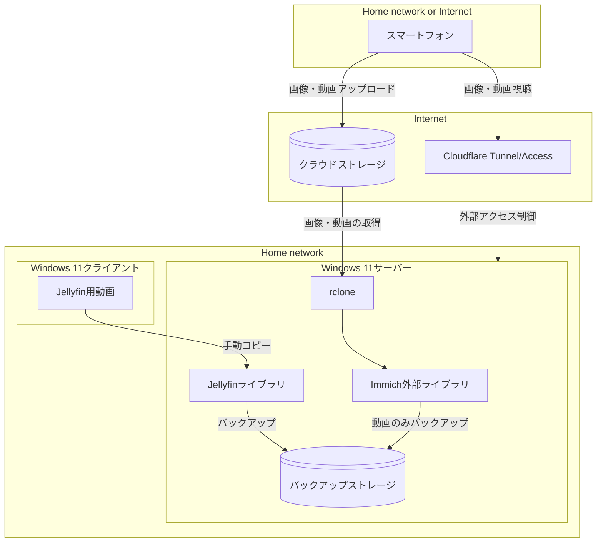
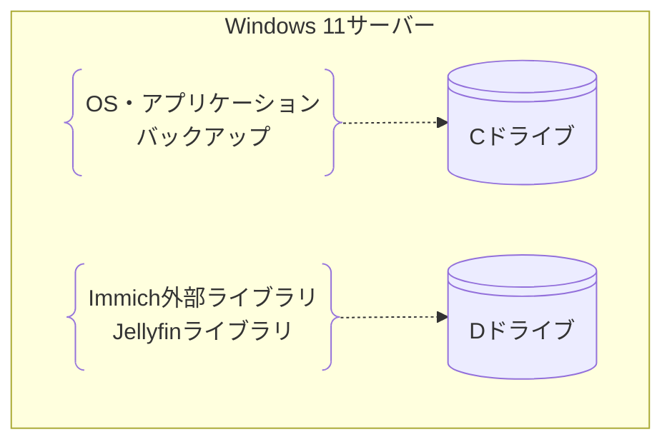

# 概要

本リポジトリは、家庭用のメディアサーバーをWindows 11 Home環境で構築・運用するためのスクリプトや設定ファイルを管理します。家庭内のミニPCなどにWindows 11をホストとして導入し、スマートフォンで撮影した画像や動画を効率的かつ安全に管理・公開することを目的とします。

## システム概要

本システムでは、家族の画像や動画を安全かつ効率的に管理・公開するためのメディアサーバーを構築します。

### 視聴方法

画像や短い動画はImmichを通じて、長尺動画はJellyfinを利用して家庭内ユーザーに提供します。外部からのアクセスについては、Cloudflare TunnelおよびCloudflare Accessを活用し、ホワイトリストに登録されたユーザーのみが安全にサーバーへアクセスできるように設計します。

### データフロー

スマートフォンで撮影した画像や動画は、端末内のクラウドストレージアプリ（Google Photos、OneDriveなど）によって自動的にクラウドストレージにアップロードされます。次に、**Windows 11サーバー上で動作するrclone**がインターネット上のクラウドストレージに接続し、新しいファイルを検出して**ホームネットワーク内**のストレージにダウンロードします。具体的には、画像はWindows上のImmich外部ライブラリに直接コピーされ、動画は一旦バックアップストレージに保存した後、同様にImmich外部ライブラリへコピーされます。これにより、画像はクラウドストレージと外部ライブラリの二重で保持され、動画は物理的に異なるドライブ間で管理されるため、安全性を高めます。

以下の構成図は、データの流れと主要コンポーネントの関係を示します：

なお、RAIDや追加バックアップは基本的に利用せず、必要に応じてオプションとして検討する方針です。セットアップや運用の自動化は現在進行中であり、今後も本リポジトリで一元的に管理・拡充します。

### 主要コンポーネント

- Immichによる画像・動画の公開
- Jellyfinによる長尺動画の公開
- rcloneによるクラウドストレージ連携
- Cloudflare Tunnel/Accessによる外部アクセス制御

---

## Windows 11サーバーの物理構成

---
