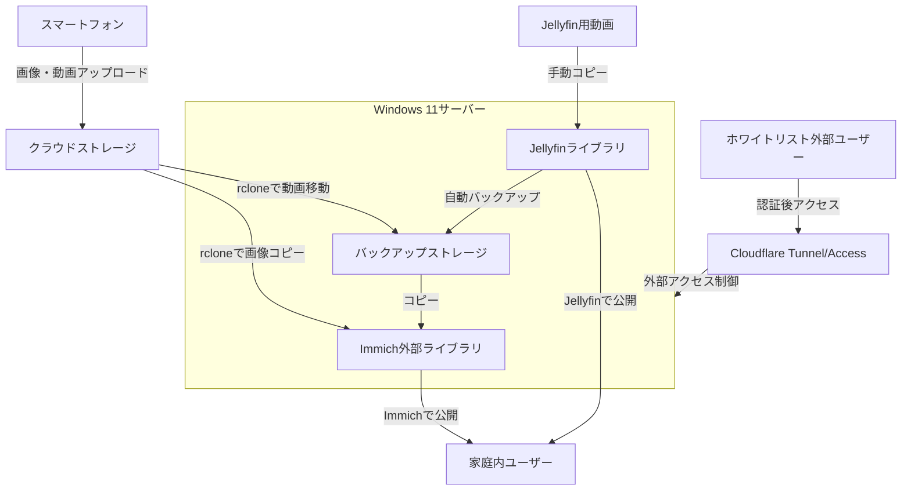

# 概要

本リポジトリは、家庭用のメディアサーバーをWindows 11 Home環境で構築・運用するためのスクリプトや設定ファイルを管理しています。家庭内のミニPCなどにWindows 11をホストとして導入し、スマートフォンで撮影した画像や動画を効率的かつ安全に管理・公開することを目的としています。

スマートフォンで撮影した画像や動画は、まずクラウドストレージにアップロードされます。画像はrcloneを利用してWindowsサーバー上のImmich外部ライブラリにコピーされ、動画は一旦バックアップストレージに保存した後、同様にImmich外部ライブラリへコピーされます。これにより、画像はクラウドストレージと外部ライブラリの二重で保持され、動画は物理的に異なるドライブ間で管理されるため、安全性を高めています。

公開方法としては、画像や短い動画はImmichを通じて、長尺動画はJellyfinを利用して家庭内ユーザーに提供します。外部からのアクセスについては、Cloudflare TunnelおよびCloudflare Accessを活用し、ホワイトリストに登録されたユーザーのみが安全にサーバーへアクセスできるように設計しています。

なお、RAIDや追加バックアップは基本的に利用せず、必要に応じてオプションとして検討する方針です。セットアップや運用の自動化は現在進行中であり、今後も本リポジトリで一元的に管理・拡充していきます。

- 本リポジトリの主な構成要素
  - Immichによる画像・動画の公開
  - Jellyfinによる長尺動画の公開
  - rcloneによるクラウドストレージ連携
  - Cloudflare Tunnel/Accessによる外部アクセス制御

---

## 構成図

---

## Windows 11サーバーの物理構成

---

## これまでの作業の概略と今後の課題

### 概略
- 本リポジトリでは、Windows 11 Home環境における家庭用メディアサーバーの構築・運用を目的とし、Immich・Jellyfin・rclone・Cloudflare Tunnel/Accessなどの構成要素を整理しました。
- システム全体のデータフローや物理構成をMermaid図で可視化し、運用方針や各ストレージの役割も明確化しました。
- Jellyfin用動画の運用フローや、動画のクラウドストレージからの移動・バックアップの流れも最新の運用方針に合わせて反映しています。

### 今後の課題
- Immich・Jellyfin・rclone・Cloudflare Tunnel/Accessのセットアップ手順や自動化スクリプトの整備・ドキュメント化
- バックアップ運用や障害時のリカバリ手順の明文化
- セキュリティ（Cloudflare Accessの詳細設定やユーザー管理）の強化
- 運用監視・ヘルスチェックの自動化と通知仕組みの拡充
- システム全体のテスト・検証および運用マニュアルの充実

---
