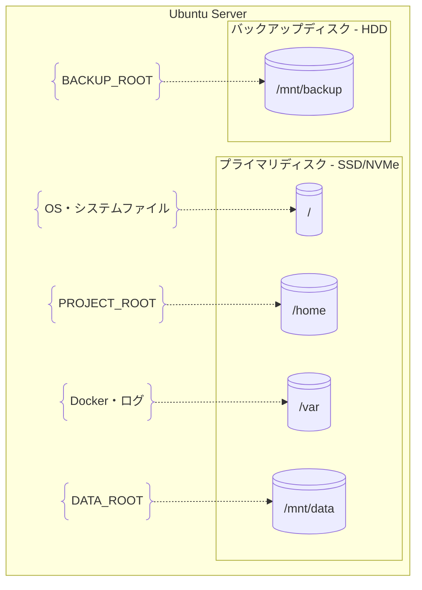

# サーバー構成

## 物理構成（環境別）

### 開発環境（WSL）

```
Windows 11
├── d:\ManageMediaServer\          # Git管理領域
└── WSL2 (Ubuntu 22.04)
    ├── /mnt/d/ManageMediaServer/  # PROJECT_ROOT
    ├── ~/dev-data/                # DATA_ROOT
    └── ~/dev-backup/              # BACKUP_ROOT
```

### 本番環境（Ubuntu Server）

#### ハードウェア要件

**最小構成:**
- CPU: 2コア以上
- メモリ: 4GB以上
- ストレージ: SSD 500GB + HDD 2TB

**推奨構成:**
- CPU: 4コア以上（Intel i5/AMD Ryzen 5相当）
- メモリ: 8GB以上
- ストレージ: NVMe SSD 1TB + HDD 4TB

#### ディスク構成



**プライマリディスク（高速SSD/NVMe）:**
- PROJECT_ROOT: `/home/mediaserver/ManageMediaServer`
- DATA_ROOT: `/mnt/data`
- OS領域: `/`, `/home`, `/var`

**バックアップディスク（大容量HDD）:**
- BACKUP_ROOT: `/mnt/backup`

### マウント設定

```bash
# /etc/fstab
/dev/sda1  /           ext4  defaults           0  1
/dev/sda2  /mnt/data   ext4  defaults,noatime   0  2
/dev/sdb1  /mnt/backup ext4  defaults,noatime   0  2
```

### 権限設定

```bash
# 基本ディレクトリ作成
sudo mkdir -p /mnt/{data,backup}

# 所有者設定
sudo chown -R mediaserver:mediaserver /mnt/data
sudo chown -R mediaserver:mediaserver /mnt/backup

# 権限設定
sudo chmod -R 755 /mnt/data
sudo chmod -R 750 /mnt/backup
```

## ネットワーク構成

### ポート設定

| サービス | ポート | 用途 |
|---------|--------|------|
| Immich | 2283 | Web UI |
| Jellyfin | 8096 | Web UI |
| SSH | 22 | 管理アクセス |
| Cloudflare Tunnel | - | 外部アクセス |

### ファイアウォール設定

```bash
# UFW設定例
sudo ufw allow ssh
sudo ufw allow from 192.168.0.0/16 to any port 2283
sudo ufw allow from 192.168.0.0/16 to any port 8096
sudo ufw enable
```

## 統一構成の詳細

統一論理構成・環境変数管理・セットアップ手順については [SCRIPT_DESIGN.md](../../SCRIPT_DESIGN.md) を参照してください。
