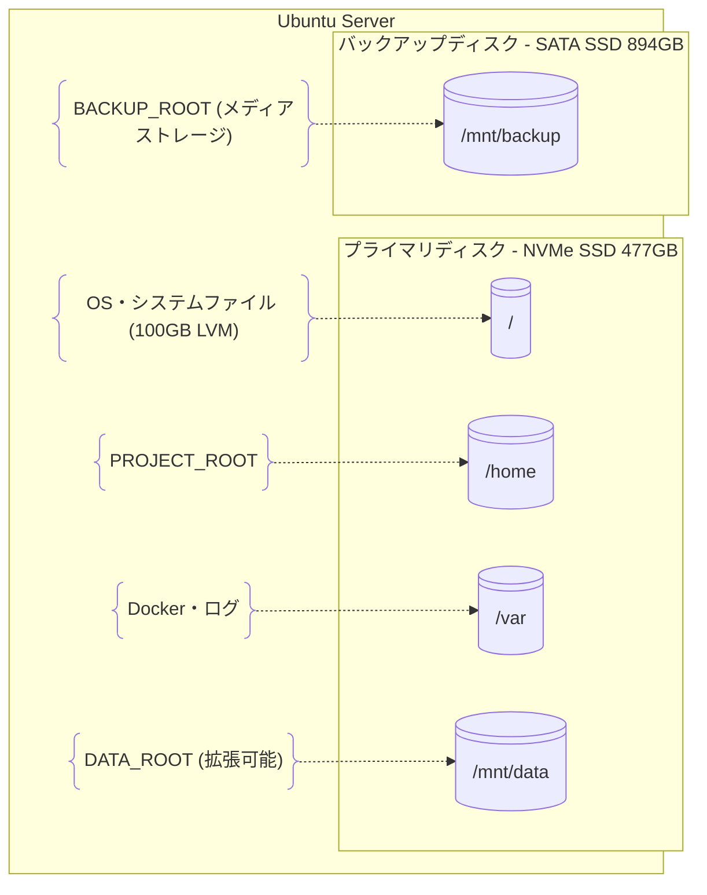

# サーバー構成

## 物理構成（環境別）

### 開発環境（WSL）

```
Windows 11
├── d:\ManageMediaServer\          # Git管理領域
└── WSL2 (Ubuntu 22.04)
    ├── /mnt/d/ManageMediaServer/  # PROJECT_ROOT
    ├── ~/dev-data/                # DATA_ROOT
    └── ~/dev-backup/              # BACKUP_ROOT
```

### 本番環境（Ubuntu Server）

#### ハードウェア要件

**最小構成:**
- CPU: 2コア以上
- メモリ: 4GB以上
- ストレージ: SSD 500GB + HDD 2TB

**推奨構成:**
- CPU: 4コア以上（Intel i5/AMD Ryzen 5相当）
- メモリ: 8GB以上
- ストレージ: NVMe SSD 1TB + SATA SSD 1TB

**現在の実装構成:**
- CPU: Intel N100 (4コア)
- メモリ: 16GB (7.8GB available)
- プライマリディスク: NVMe PCIe SSD 477GB
- バックアップディスク: SATA SSD 894GB (SanDisk Ultra II)

#### ディスク構成



**プライマリディスク（NVMe PCIe SSD 477GB）:**
- `/` (ルート): 100GB (LVM, 拡張可能)
- `/home`: PROJECT_ROOT領域
- `/var`: Docker・ログ領域
- 未使用領域: 373.89GB (LVM拡張/新パーティション用)

**バックアップディスク（SATA SSD 894GB - SanDisk Ultra II）:**
- BACKUP_ROOT: `/mnt/backup` (メディアファイルの主要ストレージ)
- 現在の状態: 未マウント（NTFS, ラベル: "Data"）

#### 現在のディスク構成詳細

```
/dev/nvme0n1 (477GB) - プライマリディスク
├─ nvme0n1p1 (1GB)    : EFI System Partition
├─ nvme0n1p2 (2GB)    : /boot
└─ nvme0n1p3 (474GB)  : LVM Physical Volume
   └─ ubuntu-lv (100GB): / (ルートファイルシステム)
   └─ 未使用 (374GB)   : 拡張可能領域

/dev/sda (894GB) - バックアップディスク
└─ sda1 (894GB)       : 未マウント (NTFS)
```

### マウント設定

```bash
# 現在の構成に基づく推奨マウント設定

# バックアップディスクの準備（必要に応じて）
# sudo umount /dev/sda1  # 既存マウントがある場合
# sudo mkfs.ext4 /dev/sda1  # NTFS → ext4への変換（データ削除注意）

# /etc/fstab 追加設定
UUID=2f91ec40-b7f8-44c2-9270-2b8b9790d6a2  /           ext4  defaults           0  1
UUID=23d79952-dddd-41be-a97d-edfdb5dd26db  /boot       ext4  defaults           0  2
UUID=AB36-B95D                             /boot/efi   vfat  defaults           0  1
UUID=4294A79B94A79049                      /mnt/backup ntfs  defaults,noatime,uid=1000,gid=1000  0  2

# 将来的な構成（バックアップディスクをext4に変換後）
# /dev/sda1  /mnt/backup ext4  defaults,noatime   0  2
```

### 権限設定

```bash
# 基本ディレクトリ作成
sudo mkdir -p /mnt/backup

# バックアップディスクマウント（NTFS用）
sudo mount -t ntfs /dev/sda1 /mnt/backup

# 所有者設定（現在のユーザー: ubuntu）
sudo chown -R ubuntu:ubuntu /mnt/backup

# 権限設定
sudo chmod -R 755 /mnt/backup

# LVM拡張での追加領域利用例
# sudo lvcreate -n data-lv -L 200G ubuntu-vg
# sudo mkfs.ext4 /dev/ubuntu-vg/data-lv
# sudo mkdir -p /mnt/data
# sudo mount /dev/ubuntu-vg/data-lv /mnt/data
```

### ディスク利用最適化案

1. **NVMeディスク（477GB）の活用**
   - OS + アプリケーション: 現在の100GB
   - 高速キャッシュ用: 50-100GB（LVM拡張）
   - 残り約270GB: 将来の拡張用

2. **SATA SSD（894GB）の活用**
   - メディアファイルストレージ
   - Immich/Jellyfinのライブラリ
   - バックアップデータ

## ネットワーク構成

### ポート設定

| サービス | ポート | 用途 |
|---------|--------|------|
| Immich | 2283 | Web UI |
| Jellyfin | 8096 | Web UI |
| SSH | 22 | 管理アクセス |
| Cloudflare Tunnel | - | 外部アクセス |

### ファイアウォール設定

```bash
# UFW設定例
sudo ufw allow ssh
sudo ufw allow from 192.168.0.0/16 to any port 2283
sudo ufw allow from 192.168.0.0/16 to any port 8096
sudo ufw enable
```

## 統一構成の詳細

統一論理構成・環境変数管理・セットアップ手順については [SCRIPT_DESIGN.md](../../SCRIPT_DESIGN.md) を参照してください。
