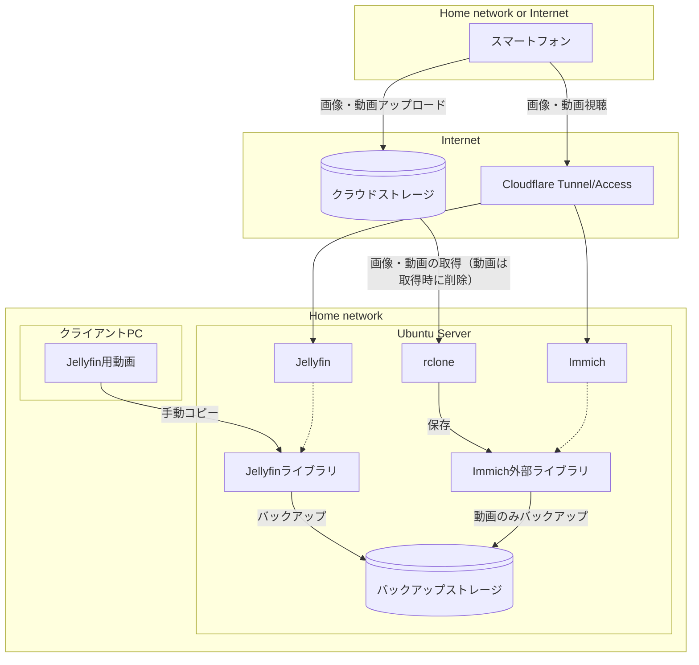

# システム設計

## 全体構成

家庭用メディアサーバーシステムの全体構成と各コンポーネントの関係を説明します。

### システム構成図

## データフロー詳細

### 1. 画像・短尺動画フロー

1. **アップロード**: スマートフォン → クラウドストレージ（自動）
2. **同期**: rclone → クラウドストレージからダウンロード
3. **保存**: Immich外部ライブラリに配置
4. **バックアップ**: 動画のみバックアップストレージにコピー
5. **公開**: Immichを通じて閲覧可能

### 2. 長尺動画フロー

1. **転送**: クライアントPC → Jellyfinライブラリ（手動）
2. **バックアップ**: Jellyfinライブラリ → バックアップストレージ
3. **公開**: Jellyfinを通じて閲覧可能

### 3. アクセスフロー

1. **内部アクセス**: ホームネットワーク → 直接アクセス
2. **外部アクセス**: インターネット → Cloudflare → サーバー

## 重要な設計決定

### バックアップ方針

- **画像**: バックアップなし（クラウドストレージが元データ）
- **短尺動画**: バックアップあり（クラウドから削除するため）
- **長尺動画**: バックアップあり（オリジナルデータ保護）

### セキュリティ方針

- **外部アクセス**: Cloudflare Accessによるホワイトリスト制御
- **内部アクセス**: 直接アクセス（信頼できるネットワーク前提）
- **データ保護**: バックアップディスクによる冗長化

### 可用性方針

- **RAID不使用**: シンプルな構成を優先
- **単一障害点**: 許容（家庭用途のため）
- **復旧方針**: バックアップからの手動復旧
