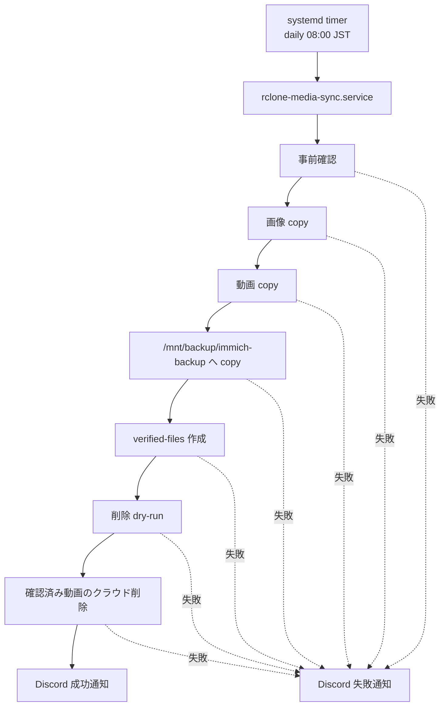

# 同期設計

## 目的

クラウドストレージ、ローカルデータ、バックアップ先の役割を分け、誤削除や同期事故によるデータ喪失を防ぐ。

この設計では、クラウドストレージに容量制限がある前提で運用する。画像はクラウドとローカルの両方に残し、動画はローカルとバックアップへ退避できた後にクラウドから削除する。

## 基本方針

- `rclone sync` は通常運用で使わない
- クラウドからローカルへの取得は `rclone copy` を使う
- ローカルからクラウドへの反映は行わない
- クラウド側で削除された画像をローカルから削除しない
- ローカル側で削除されたファイルをバックアップ先から削除しない
- バックアップ先は `/mnt/backup/immich-backup` とする
- 動画のクラウド削除は、ローカルコピーとバックアップの成功確認後だけ許可する
- 削除を伴う処理は dry-run とログ確認を必須にする
- 同期、バックアップ、削除は単一 service 内で直列実行する
- 実行スケジュールは daily、日本時間 AM 8:00 とする
- 処理完了後は成功、失敗のどちらも Discord へ通知する
- OneDrive の Personal Vault は同期対象から除外する

## 実行スケジュール

サーバー全体の timezone は変更せず、systemd timer 側で日本時間 AM 8:00 を指定する。

```ini
OnCalendar=*-*-* 08:00:00 Asia/Tokyo
Persistent=true
```

同期、バックアップ、削除を別 timer に分けると、前段の処理が終わる前に後段が動く可能性がある。そのため、daily timer は単一の service を起動し、service 内で以下を直列実行する。

1. `/mnt/data` のディレクトリ存在、書き込み可否、空き容量を確認する
2. `/mnt/backup` の mountpoint、書き込み可否、空き容量を確認する
3. 画像をクラウドからローカルへコピーする
4. 動画をクラウドからローカルへコピーする
5. ローカルから `/mnt/backup/immich-backup` へ追加コピーする
6. 確認済み動画の file list を作る
7. dry-run の結果をログに残す
8. 確認済み動画だけをクラウドから削除する
9. 成功または失敗を Discord へ通知する



## データの役割

| 領域 | 役割 | 削除反映 |
| --- | --- | --- |
| クラウドストレージ | 画像の保管元、動画の一時保管元 | ローカル削除を反映しない |
| `/mnt/data/immich/external` | Immich 外部ライブラリ | クラウド削除を反映しない |
| `/mnt/backup/immich-backup` | Immich 外部ライブラリの復旧用保管先 | ローカル削除を反映しない |

## フィルタ

画像 copy、動画 copy、remote 動画列挙、dry-run、実削除でフィルタが食い違わないようにする。

画像対象:

- `*.jpg`
- `*.jpeg`
- `*.png`
- `*.JPG`
- `*.JPEG`
- `*.PNG`

動画対象:

- `*.mov`
- `*.MOV`
- `*.mp4`
- `*.MP4`

`*.m4v` など上記以外は今回の対象外とする。

Personal Vault 除外は `config/rclone/media-sync-excludes.txt` に集約する。copy/list ではこの除外定義と対象拡張子から一時 filter file を生成し、`--filter-from` で同じ条件を適用する。削除では、除外適用済みの `verified-files` だけを `--files-from` で渡す。

```text
/個人用 Vault/**
/Personal Vault/**
```

## 画像の運用

画像はクラウドストレージとローカルの両方に残す。

- クラウドからローカルへ `rclone copy` する
- クラウド側で画像が削除されても、ローカルからは削除しない
- ローカル側で画像が削除されても、クラウドへは反映しない
- バックアップ先へは追加コピーし、ローカル削除をバックアップ先へ反映しない

## 動画の運用

動画はクラウド容量を圧迫しやすいため、ローカルとバックアップへ退避できた後にクラウドから削除する。

- クラウドからローカルへ `rclone copy` する
- ローカルから `/mnt/backup/immich-backup` へ追加コピーする
- バックアップ失敗時は hard fail とし、クラウド削除へ進まない
- 削除前に dry-run で対象をログに残す
- 実削除は確認済み対象だけに限定する
- ローカル側で動画が削除されても、バックアップ先からは削除しない

`--no-delete` 指定時は画像 copy、動画 copy、バックアップ copy まで実行し、dry-run と実削除は行わない。

## 確認済み対象の定義

動画の「確認済み対象」は、人間の目視確認ではなく、処理内で機械的に判定できる条件で定義する。

以下をすべて満たすファイルだけを確認済み対象とする。

- remote 上の動画削除候補として検出されている
- ローカルの `/mnt/data/immich/external` に同じ相対パスのファイルが存在する
- バックアップ先の `/mnt/backup/immich-backup` に同じ相対パスのファイルが存在する
- remote の `rclone lsjson` の `Size` と、local/backup の `stat -c %s` が同一バイト数で一致している
- ローカルコピーとバックアップコピーの処理が正常終了している
- dry-run が同じ file list で正常終了している

この条件を満たさないファイルは、クラウドから削除しない。ファイル内容の完全一致までは要求せず、サイズ一致で確認済みとする。

## 削除アルゴリズム

`rclone delete --include` のような拡張子一括削除は使わない。個別検証した相対パスだけを削除対象にする。

1. `rclone lsjson --recursive --files-only` を動画フィルタと共通除外付きで実行し、remote の動画候補だけを列挙する
2. 各候補について、同じ相対パスの local と backup の存在を確認する
3. remote/local/backup のサイズ一致を確認する
4. 条件を満たす相対パスだけを `/mnt/data/config/rclone/logs/verified-files-YYYYmmdd-HHMMSS.txt` に出力する
5. file list が空の場合は削除コマンドを実行しない
6. `rclone delete --dry-run --files-from verified-files-YYYYmmdd-HHMMSS.txt cloudstorageremote:/` を実行し、対象数をログに残す
7. dry-run が成功した場合だけ、同じ file list で実削除する

## バックアップの運用

バックアップ先は現在状態のミラーではなく、復旧用の保管先として扱う。

- 追加コピーを基本にする
- ローカル削除をバックアップ先へ反映しない
- バックアップ先の容量を定期確認する
- 容量不足時は hard fail とし、クラウド削除へ進まない
- 復元時は「現在のローカル状態」と「バックアップに残る過去データ」が一致しない前提で確認する

`rclone-media-sync.sh` は事前確認で以下の空き容量閾値を確認する。既定値はどちらも 1 GiB とし、必要に応じて環境変数で変更する。

| 対象 | 既定閾値 | 環境変数 |
| --- | --- | --- |
| `/mnt/data/immich/external` | `1048576` KiB | `DATA_MIN_FREE_KIB` |
| `/mnt/backup` | `1048576` KiB | `BACKUP_MIN_FREE_KIB` |

確認コマンド:

```bash
df -h /mnt/data /mnt/backup
du -sh /mnt/data/immich/external /mnt/backup/immich-backup 2>/dev/null
```

## Discord 通知

`config/env/notification.env.example` をテンプレートとして Git 管理し、実値入り `config/env/notification.env` は Git 管理しない。

過去コミットに Discord Webhook URL が含まれていたため、本番 Webhook URL はローテーション済みであることを完了条件に含める。

通知失敗は同期処理本体の失敗扱いにしない。成功時と失敗時の両方で通知する。

`curl` は Discord 通知を有効化する場合のみ必須とする。通知を無効化している場合、同期処理本体は `curl` なしでも実行できる。

## 禁止事項

- 定期同期で `rclone sync` を使う
- バックアップ失敗後にクラウド側の動画を削除する
- dry-run なしでクラウド側の動画を削除する
- file list を使わず拡張子パターンだけで一括削除する
- ローカル削除をクラウドまたはバックアップ先へ自動反映する
- Personal Vault を同期対象に含める
