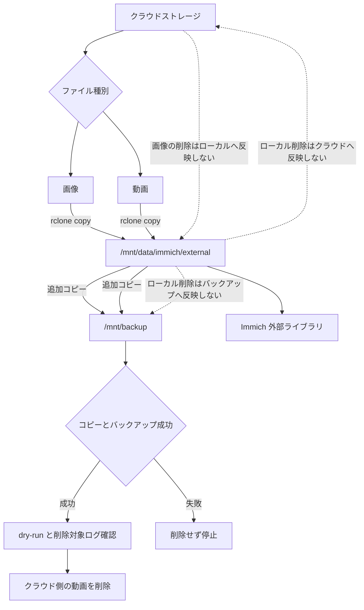
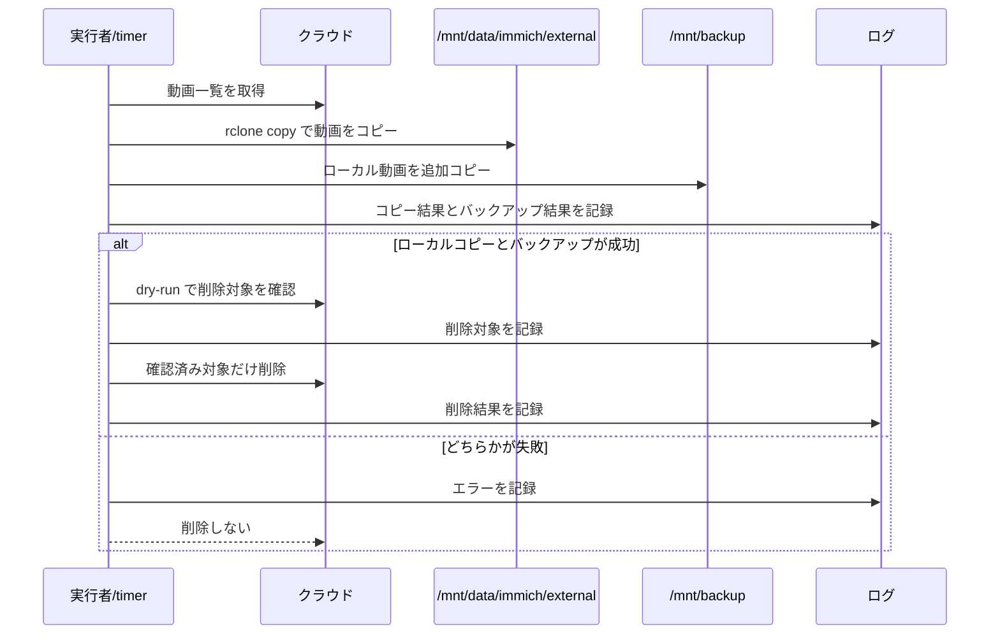

# 同期設計

## 目的

クラウドストレージ、ローカルデータ、バックアップ先の役割を分け、誤削除や同期事故によるデータ喪失を防ぐ。

この設計では、クラウドストレージに容量制限がある前提で運用する。画像はクラウドとローカルの両方に残し、動画はローカルとバックアップへ退避できた後にクラウドから削除する。

## 基本方針

- `rclone sync` は通常運用で使わない
- クラウドからローカルへの取得は `rclone copy` を使う
- ローカルからクラウドへの反映は行わない
- クラウド側で削除された画像をローカルから削除しない
- ローカル側で削除されたファイルをバックアップ先から削除しない
- 動画のクラウド削除は、ローカルコピーとバックアップの成功確認後だけ許可する
- 削除を伴う処理は dry-run とログ確認を必須にする
- OneDrive の Personal Vault は同期対象から除外する

## データの役割

| 領域 | 役割 | 削除反映 |
| --- | --- | --- |
| クラウドストレージ | 画像の保管元、動画の一時保管元 | ローカル削除を反映しない |
| `/mnt/data/immich/external` | Immich 外部ライブラリ | クラウド削除を反映しない |
| `/mnt/backup` | 復旧用の保管先 | ローカル削除を反映しない |

## 処理フロー

全体像は、画像と動画でライフサイクルが分岐するため `flowchart` で表す。状態遷移よりも「どの経路で削除が発生するか」を確認しやすいため、この図を採用する。



動画削除は不可逆操作を含むため、実行順序と停止条件を `sequenceDiagram` で明示する。処理の責務と、どの確認を通過した場合だけ削除できるかを読みやすくするため、この図を採用する。



## 画像の運用

画像はクラウドストレージとローカルの両方に残す。

- クラウドからローカルへ `rclone copy` する
- クラウド側で画像が削除されても、ローカルからは削除しない
- ローカル側で画像が削除されても、クラウドへは反映しない
- バックアップ先へは追加コピーし、ローカル削除をバックアップ先へ反映しない

想定コマンド:

```bash
rclone copy cloudstorageremote:/ /mnt/data/immich/external \
  --include "*.jpg" \
  --include "*.jpeg" \
  --include "*.png" \
  --include "*.JPG" \
  --include "*.JPEG" \
  --include "*.PNG" \
  --exclude "/個人用 Vault/**" \
  --exclude "/Personal Vault/**" \
  --log-file=/mnt/data/config/rclone/logs/sync.log \
  --log-level INFO
```

## 動画の運用

動画はクラウド容量を圧迫しやすいため、ローカルとバックアップへ退避できた後にクラウドから削除する。

- クラウドからローカルへ `rclone copy` する
- ローカルからバックアップ先へ追加コピーする
- バックアップ失敗時はクラウド削除へ進まない
- 削除前に dry-run で対象をログに残す
- 実削除は確認済み対象だけに限定する
- ローカル側で動画が削除されても、バックアップ先からは削除しない

### 確認済み対象の定義

動画の「確認済み対象」は、人間の目視確認ではなく、処理内で機械的に判定できる条件で定義する。

以下をすべて満たすファイルだけを確認済み対象とする。

- クラウド上の削除候補として検出されている
- ローカルの `/mnt/data/immich/external` に同じ相対パスのファイルが存在する
- バックアップ先の `/mnt/backup` に同じ相対パスのファイルが存在する
- クラウド、ローカル、バックアップ先のファイルサイズが一致している
- ローカルコピーとバックアップコピーの処理が正常終了している
- dry-run の削除対象に含まれている

この条件を満たさないファイルは、クラウドから削除しない。確認済み対象の判定結果はログに記録する。

想定コマンド:

```bash
rclone copy cloudstorageremote:/ /mnt/data/immich/external \
  --include "*.mov" \
  --include "*.mp4" \
  --include "*.MOV" \
  --include "*.MP4" \
  --exclude "/個人用 Vault/**" \
  --exclude "/Personal Vault/**" \
  --log-file=/mnt/data/config/rclone/logs/sync.log \
  --log-level INFO
```

削除はこのコピーとバックアップの成功後だけ実行する。削除対象の確認なしに `rclone delete` を実行してはいけない。

## バックアップの運用

バックアップ先は現在状態のミラーではなく、復旧用の保管先として扱う。

- 追加コピーを基本にする
- ローカル削除をバックアップ先へ反映しない
- バックアップ先の容量を定期確認する
- 容量不足時は、削除ではなく保管ルールを見直す
- 復元時は「現在のローカル状態」と「バックアップに残る過去データ」が一致しない前提で確認する

確認コマンド:

```bash
df -h /mnt/data /mnt/backup
du -sh /mnt/data/immich/external /mnt/backup/* 2>/dev/null
```

## 禁止事項

- 定期同期で `rclone sync` を使う
- バックアップ失敗後にクラウド側の動画を削除する
- dry-run なしでクラウド側の動画を削除する
- ローカル削除をクラウドまたはバックアップ先へ自動反映する
- Personal Vault を同期対象に含める

## 今後の実装方針

- 定期実行は画像と動画の `copy` までに限定する
- 動画削除は専用処理として分離する
- 削除処理には `--dry-run` と明示的な確認オプションを追加する
- systemd unit と timer はリポジトリ管理対象にする
- ログにはコピー、バックアップ、dry-run、削除の各結果を分けて記録する
