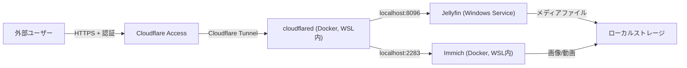

# Private Media Server Architecture with Cloudflare Tunnel

このドキュメントでは、Windows 11 ホストに設置された Jellyfin (Windows Service) と Immich (WSL 上の Docker コンテナ) を、Cloudflare Tunnel を用いて外部から安全にアクセス可能にするアーキテクチャを示します。

## 概要

- **サーバー環境**:  
  - ホストOS: Windows 11  
  - Jellyfin: Windows Service  
  - Immich: WSL 上で Docker コンテナとして稼働  
  - cloudflared: WSL 上で Docker コンテナとして稼働  

- **外部への公開**:  
  - Cloudflare Zero Trust (Access) による認証  
  - Cloudflare Tunnel (cloudflared) によるセキュアなトンネル  
  - サブドメイン:  
    - Jellyfin → https://jellyfin.nuits.me  
    - Immich → https://immich.nuits.me  

- **対象ユーザー**: 家族・友人など、限定的に使用する想定

## 全体構成図



1. ユーザーが `jellyfin.nuits.me` / `immich.nuits.me` にアクセス  
2. Cloudflare Zero Trust (Access) が事前にユーザー認証  
3. 認証を通過した通信だけが Cloudflare Tunnel 経由で `cloudflared` (WSL 内 Docker) に接続  
4. `cloudflared` が Jellyfin (8096) または Immich (2283) に転送  

## アーキテクチャ詳細

1. **Windows 11 ホスト**
   - Jellyfin を Windows Service としてインストール済み  
   - ポート 8096 (ローカル) で待ち受け  

2. **WSL + Docker**
   - Immich コンテナをポート 2283 で待ち受け  
   - cloudflared コンテナを起動し、Cloudflare Tunnel を作成  
   - トンネルの ingress 設定により、サブドメインを各サービスへルーティング  

3. **Cloudflare 側の設定**
   - Cloudflare Zero Trust (Access) で許可されたメールアドレスのみアクセス可能にする  
   - DNS レコードはプロキシ有効 (Orange Cloud)  
   - SSL終端は Cloudflare 側に集約  

## 設定ファイル例

以下は cloudflared の設定例です。

```yaml name=cloudflared-config.yml
tunnel: <YourTunnelName>
credentials-file: /etc/cloudflared/<YourTunnelID>.json
ingress:
  - hostname: jellyfin.nuits.me
    service: http://host.docker.internal:8096
  - hostname: immich.nuits.me
    service: http://host.docker.internal:2283
  - service: http_status:404
```

> ※ Windows 11 の WSL2 では、Docker コンテナがホストの Windows プロセスに接続する場合 `host.docker.internal` を利用して localhost 相当で接続できます。
